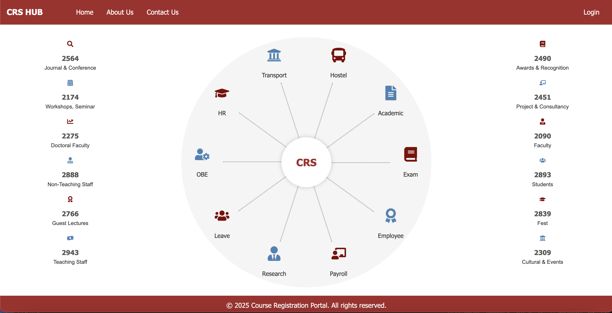
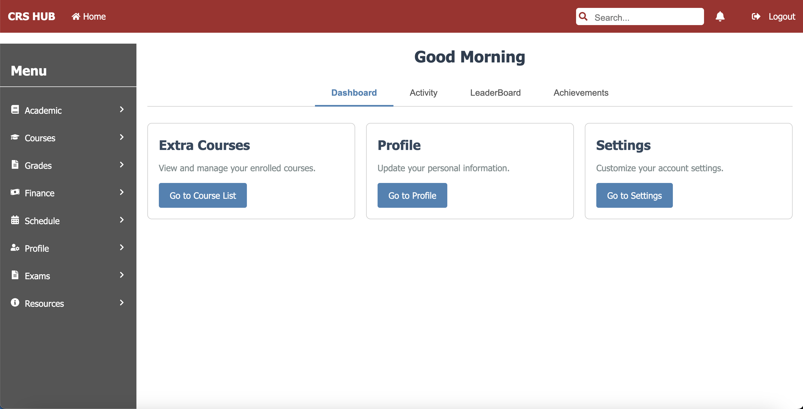
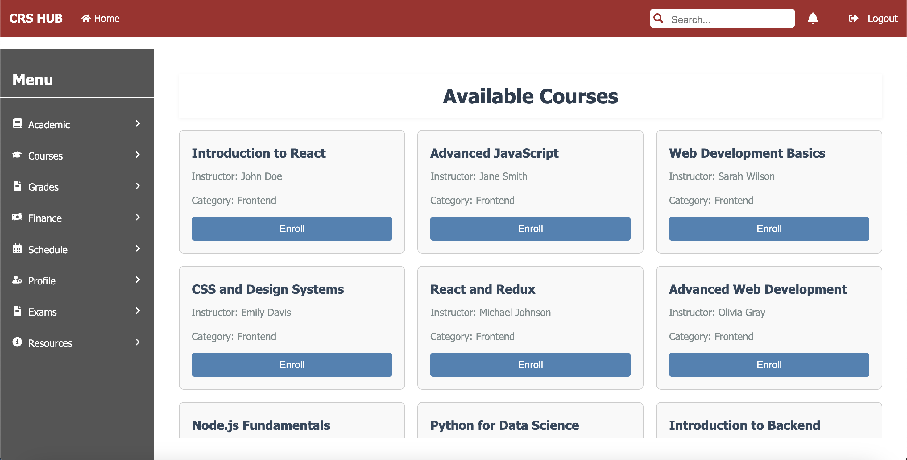
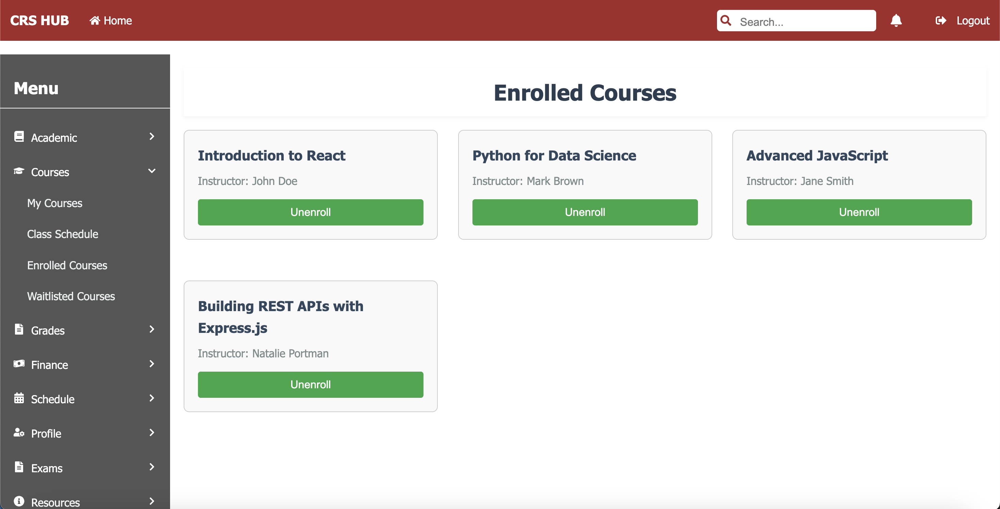
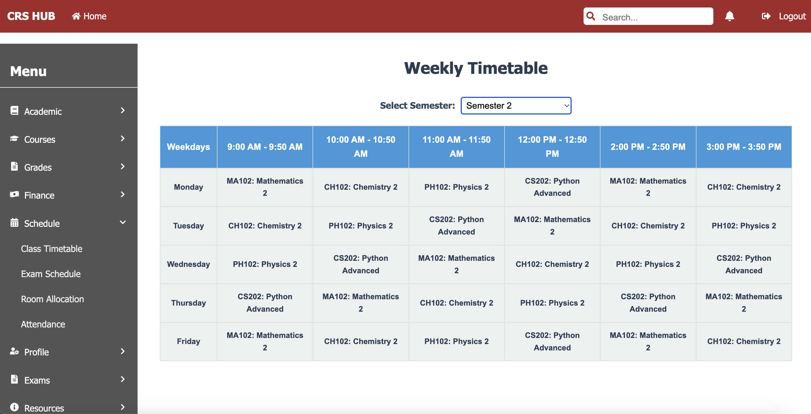

# 🎓 Course Registration Platform (Java Full-Stack)

A full-stack web application for course registration, built with **Spring Boot** (Backend) and **React.js** (Frontend).

## 🌟 Features
- **Student Role:**
  - Browse courses, register/drop courses.
  - View schedule with conflict detection.
- **Admin Role:**
  - Add/remove courses, manage instructors.
  - Generate enrollment reports.
- **Instructor Role:**
  - View assigned courses and student lists.
- **Authentication:** JWT-based secure login.

## 🛠️ Tech Stack
- **Frontend:** React.js, Bootstrap
- **Backend:** Spring Boot (Java), Spring Security
- **Database:** PostgreSQL
- **Tools:** Maven, Git

## 📸 Screenshots

### 1. CRP Home Page

### 2. User Dashboard

### 3. Available Courses for Enrollment

### 4. Enrolled Courses

### 5. Semester Timetable

## 🚀 Extra Features

### 📊 Grades Management
- Instructors can assign and update grades for students.
- Weighted grading system supported (e.g., exams, assignments, projects).
- Students can view grades per semester and overall GPA.

### 💳 Payment Integration
- Handles fee payments for course upgrades, retakes, or exam entries.
- Admin dashboard includes payment history and invoice generation.

### 📝 Exams & Scheduling
- Instructors can schedule exams and publish exam-related content.
- Students can view upcoming exams and results.
- Prevents exam scheduling conflicts based on registered courses.

### 🧾 Reporting
- JasperReports integrated to generate PDF reports:
  - Enrollment summaries
  - Grade sheets
  - Instructor performance

## 🧑‍💻 Contribution

Contributions are welcome! If you'd like to improve features, fix bugs, or add new modules.

